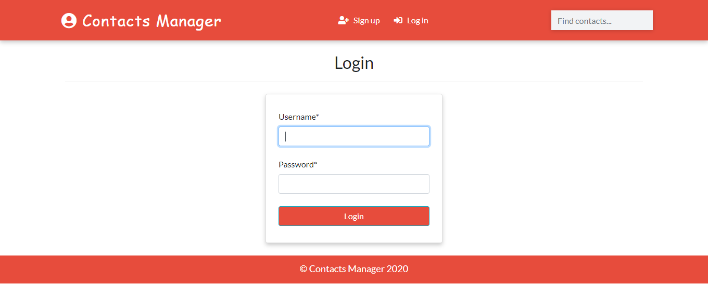

<h1 align="center">Contact Manager App Django</h1>
<a href="#">
  <div align="center">
    
  </div>
</a>

## Functionalities
- [x] User Authentication
- [x] Gender Based Search
- [x] Database CRUD
- [x] User Authorization
- [x] Profile Image

## How To Run
```

cd Contact-Manager-Django
pip install -r requirements.txt
python manage.py runserver
```
## Access to the Admin Panel
```
python manage.py createsuperuser
```

## Author
Madhu

If you liked the repo then kindly support it by giving it a star ⭐!


